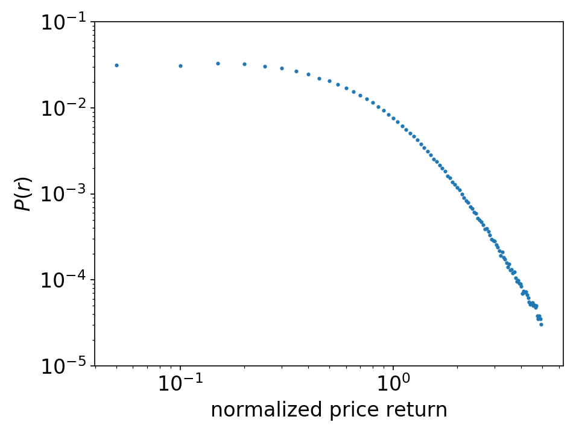

Probability Distribution
____________

Description
^^^^^^^^^^^

The probability distribution function of the price returns :math:`P(r)` has been extensively studied in different financial markets over different time scales 

It has been empirically verified that the probability distribution :math:`P(r)` consistently has a power-law decay in the tails

.. math::
   :nowrap:

   \begin{equation}
      P(r)\propto r^{-\alpha}.
   \end{equation}

Code Example
^^^^^^^^^^^^

References
^^^^^^^^^^