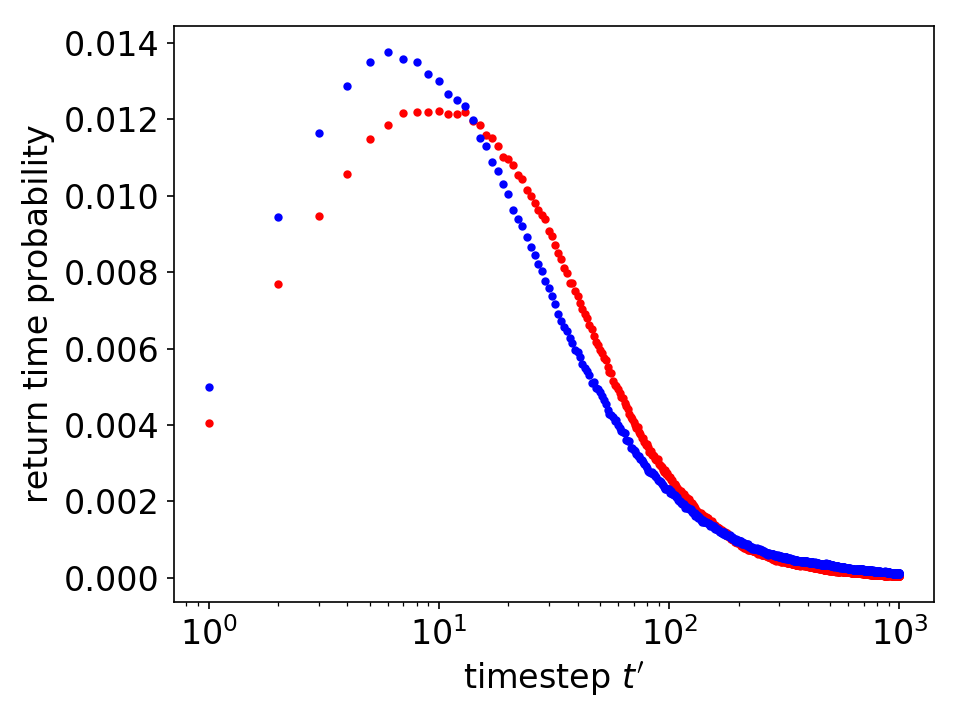

Gain/Loss Asymmetry
___________________

Description
^^^^^^^^^^^

The gain/loss asymmetry refers to the observation that the speed of price fall is faster than that of the price rise.
:cite:`Jensen_2006`

.. math::
   :nowrap:

   \begin{equation}
      T^{t}(\theta) = \left\{ \begin{array}{ll}
      \inf{\{ t'| \log{p_{t+t'}}-\log{p_{t}} >=\theta,t'>0 \}} & (\theta>0) \\
      \inf{\{ t'| \log{p_{t+t'}}-\log{p_{t}} <=\theta,t'>0 \}} & (\theta<0).
      \end{array} \right.
   \end{equation}

.. centered::
   Fig. Averaged result for S&P500 firms daily price return

Code Example
^^^^^^^^^^^^

.. literalinclude:: ../../examples/gainloss_asymmetry.py
   :lines: 1-3,6-
   :language: python

References
^^^^^^^^^^

.. bibliography:: refs.bib
   :cited:
